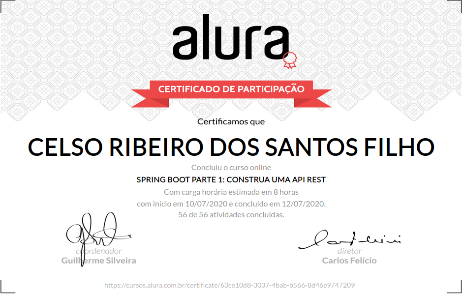

# Alura Cursos Online
+ Aprenda as vantagens de um dos frameworks mais utilizados no mundo e requisitados no mercado!

# Spring Boot Parte 1: Construa uma API Rest

## O que estou aprendendo neste curso:

+ Crie aplicações Java com o Spring Boot.

+ Configura sua aplicação Spring sem o uso de arquivos XML.

+ Acelere seu desenvolvimento web com ajuda do Spring Devtools.

+ Aprenda o estilo arquitetural REST.

+ Use o Spring Data e Bean Validation.

## Conteúdo das Aulas

+ Introdução ao Spring Boot       
        
        Introdução
        Hello World
        (Opcional) Download do projeto inicial
        Sobre Spring e Spring Boot
        Consolidando o seu conhecimento

+ Publicando Endpoints
          
        Conhecendo o projeto
        Download das classes de modelo
        Primeiro Endpoint da API
        Uso da anotação @ResponseBody
        Usando DTO
        Módulo Spring Boot DevTools
        O que é REST
        Consolidando o seu conhecimento

+ Usando Spring Data  
           
        Começando com Spring Data JPA
        Configurações do banco de dados da aplicação
        Arquivo application.properties
        Arquivo data.sql
        Utilizando Repository
        Interface que segue o padrão Repository
        Consulta com filtros
        Filtrando dados pelo relacionamento
        Consolidando o seu conhecimento

+ Trabalhando com POST 
        
        Cadastrando tópicos
        Uso da anotação @RequestBody
        Boas práticas no cadastro
        Métodos com retorno void
        Testando o cadastro com Postman
        O cabeçalho Content-Type
        Consolidando o seu conhecimento
        
+ Validação com Bean Validation 

        Validações com Bean Validation
        Uso da anotação @Valid
        Simplificando o JSON
        Uso da anotação @ResponseStatus no RestControllerAdvice
        Consolidando o seu conhecimento

+ Métodos PUT, DELETE e tratamento de erro 

        Detalhando tópicos
        Paths dinâmicos
        Atualizando tópicos
        Controle transacional
        Removendo tópicos
        Anotação dos métodos de remoção
        Tratando o erro 404
        Vantagem de devolver o erro 404
        Consolidando o seu conhecimento
        Projeto do curso
        O que aprendemos?
        Conclusão

# Certificado de conclusão

<!--  -->