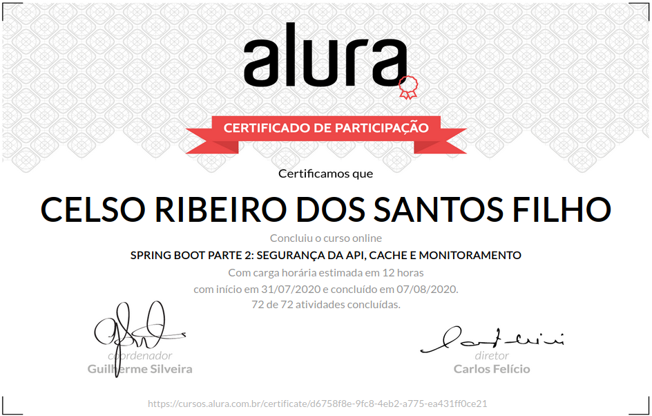

# Alura Cursos Online
+ Aprenda as vantagens de um dos frameworks mais utilizados no mundo e requisitados no mercado!

# Spring Boot Parte 2: Segurança da API, Cache e Monitoramento

## O que estou aprendendo neste curso:

+ Pagine e ordene os resultados da API.

+ Melhore desempenho com Spring Cache.

+ Protega a API com Spring Security e JWT.

+ Monitore os endpoints com Spring Boot Actuator e Admin.

+ Documente a API com Swagger   .

## Conteúdo das Aulas

+ Paginação e ordenação de recursos      
        
        Introdução
        Projeto inicial do treinamento
        Paginação
        Vantagem de utilizar a interface Page
        Ordenação
        Ordenando registros na lista
        Simplificando a paginação e ordenação
        Uso da anotação @PageableDefault
        Consolidando o seu conhecimento

+ Melhorando desempenho com Spring Cache 
          
        Utilizando cache
        Anotação @Cacheable
        Invalidando o cache
        Sobre a anotação @CacheEvict
        Boas práticas no uso de cache
        Consolidando o seu conhecimento

+ Proteção com Spring Security 
           
        Habilitando o Spring Security
        Spring Security e os endpoints da API
        Liberando acesso aos endpoints públicos
        Por que indicar o método GET?
        Restringindo o acesso aos endpoints privados
        Objetivo do método anyRequest().authenticated()
        Autenticando o usuário
        Lógica de autenticação
        Consolidando o seu conhecimento

+ Gerando token com JWT
        
        Projeto da aula anterior
        Por que autenticar via token
        Configurando autenticação Stateless
        Página de login
        Gerando tokens com JWT
        Injeção de propriedades
        Arquivo application.properties
        Retornando o token para o cliente
        Token
        Consolidando o seu conhecimento
        
+ Autenticação via JWT  

        Recuperando o token do header Authorization
        Anotação para registrar o filtro?
        Validando o token
        Injeção de dependências no Filter
        Autenticando o cliente via Spring Security
        Forçando a autenticação via SecurityContextHolder
        Consolidando o seu conhecimento

+ Monitoramento com Spring Boot Actuator

        Projeto da aula anterior
        Monitoramento com Spring Boot Actuator
        Spring Boot Actuator
        Arquivo application.properties
        Conhecendo Spring Boot Admin
        (Opcional) Download do projeto de monitoramento
        Sobre o Spring Boot Admin
        Monitorando a nossa API com Spring Boot Admin
        Spring Boot Admin Client
        Consolidando o seu conhecimento

+ Documentação da API com Swagger 

        Por que documentar a API
        Documentação da API com SpringFox Swagger
        Documentação da API
        Enviando token JWT no Swagger
        Token JWT na documentação do Swagger
        Classe SwaggerConfigurations
        Classe SecurityConfigurations
        Consolidando o seu conhecimento
        Projeto do curso
        O que aprendemos?
        Conclusão
<!-- 
# Certificado de conclusão

https://cursos.alura.com.br/certificate/63ce10d8-3037-4bab-b566-8d46e9747209

 -->