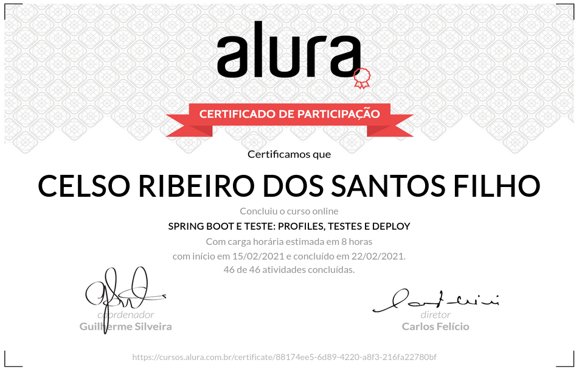

# Alura Cursos Online
+ Aprenda as vantagens de um dos frameworks mais utilizados no mundo e requisitados no mercado!

# Spring Boot Parte 3: Profiles, Testes e Deploy

## O que estou aprendendo neste curso:

+ Atualize a versão do Spring Boot da API.

+ Proteja endpoints baseados em perfil de usuário.

+ Separe configurações em Profiles.

+ Escreva testes automatizados de componentes do Spring Boot.

+ Simule o deploy da API localmente.

+ Utilize Docker na API.

+ Realize o deploy da API no Heroku.

## Conteúdo das Aulas

+ Mais segurança      
            
        Introdução
        Atualizando o Spring Boot
        Upgrade da versão do Spring Boot
        Autorização baseada em Roles
        Restringindo o acesso a determinado endpoint

+ Profiles
          
        Spring profiles
        Utilização de profiles
        Beans baseados em profiles
        Utilização da anotação @Profile

+ Testes automatizados
        
        Testes automatizados com Spring Boot
        Anotação @SpringBootTest
        Testando um repository
        Anotação @DataJpaTest
        Testando o repository com outro banco de dados
        Alterando o banco de dados utilizado durante os testes
        Testando um Controller
        Injetando o MockMvc

+ Deploy 
                    
        Gerando o jar da aplicação
        Geração do jar da aplicação via Maven
        Externalizando senhas com variáveis de ambiente
        Propriedades definidas por variáveis de ambiente
        Deploy tradicional com arquivo war
        Alteração do artefato de build de jar para war
        
+ Deploy com Docker e na nuvem  
     
        Gerando imagem Docker da aplicação
        Arquivo Dockerfile
        Rodando a aplicação via Docker
        Variáveis de ambiente no Docker
        Deploy no Heroku
        Spring Boot em ambientes Cloud
        Faça como eu fiz
        Conclusão

# Certificado de conclusão

https://cursos.alura.com.br/certificate/88174ee5-6d89-4220-a8f3-216fa22780bf

