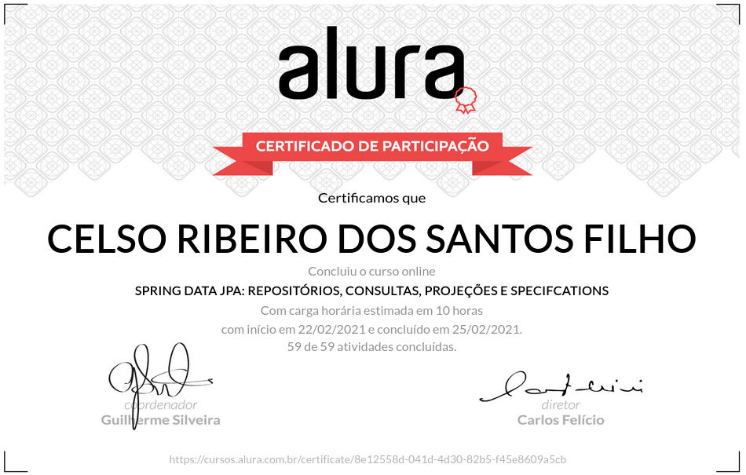

# Alura Cursos Online
+ Aprenda as vantagens de um dos frameworks mais utilizados no mundo e requisitados no mercado!

# Spring Data JPA: Repositórios, Consultas, Projeções e Specifcations

## O que estou aprendendo neste curso:

+ Aprenda a usar os repositórios poderosos do Spring Data.

+ Gere queries sem escrever nenhum JPQL.

+ Use paginação e ordenação pelo Spring.

+ Aprenda a construir queries dinâmicas através dos Specifications.

+ Saiba lidar com os repositórios e as unções mais comuns.

## Conteúdo das Aulas

+ Primeiro Repositório   
            
        Apresentação
        Sobre o ambiente
        Configuração de ambiente
        Criando a aplicação
        Configurando o banco
        Gerando o banco de dados
        Sobre SpringAplication.run()
        Usando CrudRepository
        Inserindo valores
        Qual o benefício do CrudRepository?
        Para saber mais: Injeção de Dependências

+ Operações CRUD
          
        Salvando o registro
        Atualizando o registro
        Quais operações?
        Visualizar e deletar
        Sobre findById
        Desafio
        Solução proposta
        Para saber mais: Mais métodos

+ Derived Queries, JPQL e Native Queries
        
        Derived Query
        Para saber mais: Mais Derived Queries
        Usando JPQL
        Para saber mais: Queries entre relacionamentos
        Completando a aplicação
        Native Query
        Qual tipo de query usar?

+ Paginação e Ordenação
                    
        Paginação
        Para saber mais: Paginação e Derived Query
        Tipos de repositórios
        Ordenação
        Como paginar?
        
+ Trabalhando com Projeções  
     
        Criação da projeção
        Visualizando a projeção
        Qual o porquê dessa interface?
        Para saber mais: Class based Projection

+ Consultas dinâmicas  

        Estrutura da Specification
        O que é essa Specification?
        Compondo Specifications
        Executando a pesquisa dinâmica
        Para saber mais: MongoDB
        Faça como eu fiz
        Projeto final do curso
        O que aprendemos?
        Conclusão

<!-- # Certificado de conclusão

https://cursos.alura.com.br/certificate/88174ee5-6d89-4220-a8f3-216fa22780bf

 -->